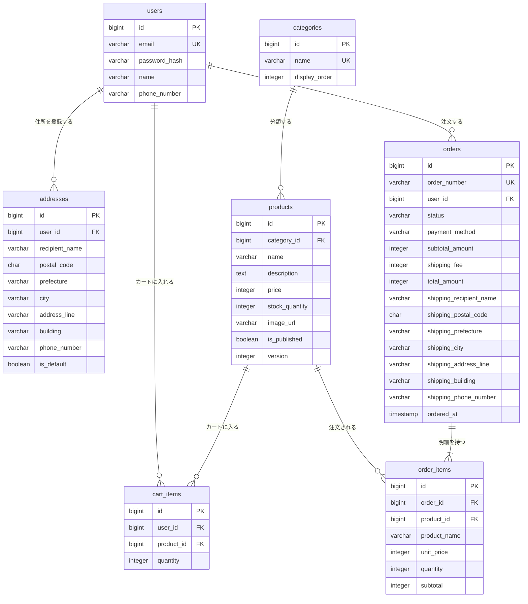

# ecsite ER図・テーブル定義書

ECサイトアプリ（商品一覧・商品検索・カート・購入・ユーザー登録）のデータベース設計書。DBは検証用Todoアプリと同じ PostgreSQL 17 を前提とする。

## 1. 前提・設計方針

- **カートはログイン必須**: カートはユーザーに紐づけてDBに保存する。未ログイン（ゲスト）のカートや、ログイン時のゲストカート統合は扱わない。
- **購入時点の情報を注文に複製する**: 商品名・単価・配送先は購入後に変わりうるため、`orders`・`order_items` に購入時点の値をコピーして保持する（商品マスタ・住所録を後から変更しても過去の注文内容は変わらない）。
- **物理削除しない**: 商品は `is_published`（公開フラグ）で非公開にし、行は削除しない。ユーザーの退会は本設計の対象外とする。このため外部キーはすべて `ON DELETE RESTRICT` とする。
- **金額は税込の円・整数**: 金額カラムは `integer`（円）とし、税込価格を保持する。税率・税額の内訳は保持しない。
- **決済情報は保存しない**: クレジットカード番号等は本アプリのDBに保存しない。決済代行サービスとの連携は対象外とし、支払方法の種別のみ保持する。
- **在庫は商品テーブルで管理する**: 購入時に `products.stock_quantity` を減算する。同時購入による在庫の過剰減算を防ぐため、`version` カラムで楽観ロックを行う（`UPDATE ... WHERE id = ? AND version = ?` で更新し、更新件数が0件なら競合と判定する）。
- **管理機能は対象外**: 商品・カテゴリの登録や注文ステータスの更新を行う管理画面は本設計の対象外とする。商品・カテゴリは初期データとして投入する。
- **DDLで作成する**: スキーマはDDL `app/docker/postgresql/initdb/01_init.sql` で作成する。PostgreSQL コンテナの初回起動時（データボリュームが空のとき）に自動実行される。バックエンド（Go / GORM）は `AutoMigrate` を使わず、スキーマを変更しない。

### 共通カラム

全テーブルに以下を持つ（`order_items` は作成後に更新しないため `updated_at` を持たない）。

| カラム名 | 型（PostgreSQL） | NULL許容 | デフォルト | 説明 |
|---|---|---|---|---|
| `id` | `bigint` | 不可 | `GENERATED BY DEFAULT AS IDENTITY` | 主キー（DBの IDENTITY で採番） |
| `created_at` | `timestamp` | 不可 | `CURRENT_TIMESTAMP` | 作成日時。以後更新しない |
| `updated_at` | `timestamp` | 不可 | `CURRENT_TIMESTAMP` | 更新日時。更新のたびにアプリ側で設定する |

以降のテーブル定義では共通カラムの記載を省略する。

## 2. ER図

| テーブル | 論理名 | 概要 |
|---|---|---|
| `users` | ユーザー | 会員登録したユーザー。ログインIDはメールアドレス |
| `addresses` | 配送先住所 | ユーザーが登録する配送先。1ユーザーに複数件、うち1件を既定にできる |
| `categories` | カテゴリ | 商品の分類。商品一覧の絞り込みに使う |
| `products` | 商品 | 販売する商品と在庫数 |
| `cart_items` | カート明細 | ユーザーのカートに入っている商品と数量 |
| `orders` | 注文 | 購入確定した注文のヘッダ。配送先・金額を購入時点の値で保持する |
| `order_items` | 注文明細 | 注文に含まれる商品。商品名・単価を購入時点の値で保持する |

## 3. テーブル定義

### 3.1 `users`（ユーザー）

| カラム名 | 型（PostgreSQL） | NULL許容 | デフォルト | 制約 | 説明 |
|---|---|---|---|---|---|
| `email` | `varchar(255)` | 不可 | - | UNIQUE, CHECK（`email = lower(email)`） | メールアドレス。ログインIDとして使う。小文字に正規化して保存する |
| `password_hash` | `varchar(255)` | 不可 | - | - | パスワードのハッシュ値（BCrypt）。平文は保存しない |
| `name` | `varchar(100)` | 不可 | - | - | 氏名 |
| `phone_number` | `varchar(20)` | 可 | - | - | 電話番号（ハイフンなし） |

### 3.2 `addresses`（配送先住所）

| カラム名 | 型（PostgreSQL） | NULL許容 | デフォルト | 制約 | 説明 |
|---|---|---|---|---|---|
| `user_id` | `bigint` | 不可 | - | FK → `users.id` | 所有ユーザー |
| `recipient_name` | `varchar(100)` | 不可 | - | - | 宛名 |
| `postal_code` | `char(7)` | 不可 | - | CHECK（数字7桁） | 郵便番号（ハイフンなし） |
| `prefecture` | `varchar(10)` | 不可 | - | - | 都道府県 |
| `city` | `varchar(100)` | 不可 | - | - | 市区町村 |
| `address_line` | `varchar(200)` | 不可 | - | - | 町名・番地 |
| `building` | `varchar(200)` | 可 | - | - | 建物名・部屋番号 |
| `phone_number` | `varchar(20)` | 不可 | - | - | 配送用の電話番号（ハイフンなし） |
| `is_default` | `boolean` | 不可 | `false` | 部分UNIQUE（`user_id`、`is_default = true` の行のみ） | 既定の配送先。1ユーザーにつき最大1件 |

### 3.3 `categories`（カテゴリ）

| カラム名 | 型（PostgreSQL） | NULL許容 | デフォルト | 制約 | 説明 |
|---|---|---|---|---|---|
| `name` | `varchar(50)` | 不可 | - | UNIQUE | カテゴリ名 |
| `display_order` | `integer` | 不可 | `0` | - | 表示順（昇順） |

カテゴリは1階層とする（親子関係は持たない）。

### 3.4 `products`（商品）

| カラム名 | 型（PostgreSQL） | NULL許容 | デフォルト | 制約 | 説明 |
|---|---|---|---|---|---|
| `category_id` | `bigint` | 不可 | - | FK → `categories.id` | カテゴリ |
| `name` | `varchar(200)` | 不可 | - | - | 商品名。検索対象 |
| `description` | `text` | 可 | - | - | 商品説明。検索対象 |
| `price` | `integer` | 不可 | - | CHECK（`>= 0`） | 販売価格（税込・円） |
| `stock_quantity` | `integer` | 不可 | `0` | CHECK（`>= 0`） | 在庫数。0 の商品は一覧に表示するがカートに入れられない |
| `image_url` | `varchar(500)` | 可 | - | - | 商品画像のURL |
| `is_published` | `boolean` | 不可 | `true` | - | 公開フラグ。`false` の商品は一覧・検索・詳細に表示しない |
| `version` | `integer` | 不可 | `0` | - | 楽観ロック用のバージョン。在庫を更新するたびに +1 する |

### 3.5 `cart_items`（カート明細）

| カラム名 | 型（PostgreSQL） | NULL許容 | デフォルト | 制約 | 説明 |
|---|---|---|---|---|---|
| `user_id` | `bigint` | 不可 | - | FK → `users.id` | カートの持ち主 |
| `product_id` | `bigint` | 不可 | - | FK → `products.id` | 商品 |
| `quantity` | `integer` | 不可 | `1` | CHECK（`>= 1`） | 数量 |

- `(user_id, product_id)` に UNIQUE 制約を付ける。同じ商品をもう一度カートに入れた場合は行を追加せず `quantity` を加算する。
- カート専用のヘッダテーブルは設けず、ユーザーのカートは「`user_id` が一致する `cart_items` 全件」とする。
- 単価はカートに保持せず、表示時に `products.price` を参照する（購入確定時に `order_items.unit_price` へ複製する）。

### 3.6 `orders`（注文）

| カラム名 | 型（PostgreSQL） | NULL許容 | デフォルト | 制約 | 説明 |
|---|---|---|---|---|---|
| `order_number` | `varchar(20)` | 不可 | - | UNIQUE | 画面・メールに表示する注文番号（例: `20260921-000123`） |
| `user_id` | `bigint` | 不可 | - | FK → `users.id` | 注文したユーザー |
| `status` | `varchar(20)` | 不可 | `'ORDERED'` | CHECK（下記の値のみ） | 注文ステータス |
| `payment_method` | `varchar(20)` | 不可 | - | CHECK（下記の値のみ） | 支払方法 |
| `subtotal_amount` | `integer` | 不可 | - | CHECK（`>= 0`） | 商品合計（`order_items.subtotal` の合計） |
| `shipping_fee` | `integer` | 不可 | - | CHECK（`>= 0`） | 送料 |
| `total_amount` | `integer` | 不可 | - | CHECK（`= subtotal_amount + shipping_fee`） | 支払総額 |
| `shipping_recipient_name` | `varchar(100)` | 不可 | - | - | 配送先の宛名（購入時点の値） |
| `shipping_postal_code` | `char(7)` | 不可 | - | CHECK（数字7桁） | 配送先の郵便番号（購入時点の値） |
| `shipping_prefecture` | `varchar(10)` | 不可 | - | - | 配送先の都道府県（購入時点の値） |
| `shipping_city` | `varchar(100)` | 不可 | - | - | 配送先の市区町村（購入時点の値） |
| `shipping_address_line` | `varchar(200)` | 不可 | - | - | 配送先の町名・番地（購入時点の値） |
| `shipping_building` | `varchar(200)` | 可 | - | - | 配送先の建物名（購入時点の値） |
| `shipping_phone_number` | `varchar(20)` | 不可 | - | - | 配送先の電話番号（購入時点の値） |
| `ordered_at` | `timestamp` | 不可 | `CURRENT_TIMESTAMP` | - | 注文日時 |

配送先は `addresses` への外部キーを持たず、購入時点の住所の値をコピーする（住所録の変更・削除が過去の注文に影響しないようにするため）。

**`status` の値**（Go では文字列型の定数として定義する）

| 値 | 表示名 | 説明 |
|---|---|---|
| `ORDERED` | 注文受付 | 購入確定直後 |
| `SHIPPED` | 発送済み | 発送した |
| `DELIVERED` | 配達完了 | 配達が完了した |
| `CANCELLED` | キャンセル | 注文を取り消した |

**`payment_method` の値**

| 値 | 表示名 |
|---|---|
| `CREDIT_CARD` | クレジットカード |
| `BANK_TRANSFER` | 銀行振込 |
| `CASH_ON_DELIVERY` | 代金引換 |

### 3.7 `order_items`（注文明細）

| カラム名 | 型（PostgreSQL） | NULL許容 | デフォルト | 制約 | 説明 |
|---|---|---|---|---|---|
| `order_id` | `bigint` | 不可 | - | FK → `orders.id` | 注文 |
| `product_id` | `bigint` | 不可 | - | FK → `products.id` | 商品（商品詳細へのリンク用） |
| `product_name` | `varchar(200)` | 不可 | - | - | 商品名（購入時点の値） |
| `unit_price` | `integer` | 不可 | - | CHECK（`>= 0`） | 単価（購入時点の `products.price`） |
| `quantity` | `integer` | 不可 | - | CHECK（`>= 1`） | 数量 |
| `subtotal` | `integer` | 不可 | - | CHECK（`= unit_price * quantity`） | 小計 |

- `(order_id, product_id)` に UNIQUE 制約を付ける（1注文内で同じ商品は1行にまとめる）。
- 作成後に更新しないため `updated_at` を持たない。

## 4. インデックス

主キー・UNIQUE制約で作成されるインデックス以外に、以下を作成する。

| テーブル | カラム | 種類 | 用途 |
|---|---|---|---|
| `addresses` | `user_id` | B-tree | ユーザーの住所一覧の取得 |
| `addresses` | `user_id` WHERE `is_default = true` | 部分UNIQUE | 既定の配送先を1ユーザー1件に制限 |
| `products` | `category_id` | B-tree | カテゴリでの絞り込み |
| `products` | `name` | GIN（`pg_trgm`） | 商品名の部分一致検索（`ILIKE '%キーワード%'`） |
| `orders` | `(user_id, ordered_at DESC)` | B-tree | 注文履歴を新しい順に取得 |
| `order_items` | `product_id` | B-tree | 商品から注文明細の参照（外部キー） |

- `cart_items` は UNIQUE `(user_id, product_id)`、`order_items` は UNIQUE `(order_id, product_id)` の先頭列で `user_id`・`order_id` の検索をまかなうため、単独のインデックスは作らない。
- `pg_trgm` 拡張（`CREATE EXTENSION pg_trgm`）を使わない場合、商品名の部分一致検索は全件走査になる。商品件数が少ない検証用途なら省略してよい。

## 5. 購入確定時のデータ更新

購入確定（カートの商品を購入する）では、以下を1トランザクションで行う。いずれかが失敗した場合はすべてロールバックする。

1. `cart_items` から対象ユーザーの明細を取得する（0件なら購入不可）
2. 各商品の `products` を取得し、公開中（`is_published = true`）かつ `stock_quantity >= cart_items.quantity` であることを確認する
3. `products.stock_quantity` から数量を減算する。`version` による楽観ロックで、他の購入と競合した場合は失敗させる
4. `orders` を1行作成する（配送先は選択した `addresses` の値をコピー、金額を計算）
5. カート明細ごとに `order_items` を作成する（商品名・単価を `products` からコピー）
6. 対象ユーザーの `cart_items` を全件削除する
