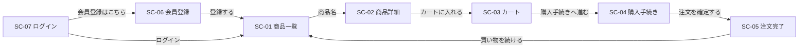

# ecsite 画面一覧・共通仕様書

ECサイトアプリの画面一覧と、全画面に共通する仕様（ヘッダー・認証・アクセス制御・表示形式・エラーページ）をまとめる。各画面の詳細は画面ごとの設計書を参照する。テーブル構成は「ecsite-ER図・テーブル定義書.md」を参照。

## 1. 前提

- スタック: Spring Boot 3.3.4 / Java 17 / Maven / Thymeleaf / Spring Data JPA / Spring Security / PostgreSQL 17（検証用Todoアプリを作り替える）。
- レイヤー構成: `Controller` → `Service` → `Repository` → `Entity`。購入確定のように複数テーブルを1トランザクションで更新する処理があるため、Todoアプリと異なり `Service` 層を設ける。
- パッケージ: `com.example.ecsite`（`app/src/main/java/com/example/ecsite/`）。
- スキーマはDDL（`app/docker/postgresql/initdb/01_init.sql`）で作成し、`spring.jpa.hibernate.ddl-auto=validate` とする。
- 対象外: 管理画面（商品・カテゴリ登録、注文ステータス変更）、注文履歴画面、配送先住所の編集・削除画面、会員情報変更・退会、パスワード再設定、実際の決済処理。

## 2. 画面一覧

| 画面ID | 画面名称 | パス | ログイン要否 | 設計書 |
|---|---|---|---|---|
| SC-01 | 商品一覧画面 | `GET /products`（`GET /` は `/products` へリダイレクト） | 不要 | ecsite-商品一覧画面設計書.md |
| SC-02 | 商品詳細画面 | `GET /products/{id}` | 不要 | ecsite-商品詳細画面設計書.md |
| SC-03 | カート画面 | `GET /cart` | 必要 | ecsite-カート画面設計書.md |
| SC-04 | 購入手続き画面 | `GET /checkout` | 必要 | ecsite-購入手続き画面設計書.md |
| SC-05 | 注文完了画面 | `GET /orders/{orderNumber}/complete` | 必要 | ecsite-注文完了画面設計書.md |
| SC-06 | 会員登録画面 | `GET /signup` | 不要（ログイン中はアクセス不可） | ecsite-会員登録画面設計書.md |
| SC-07 | ログイン画面 | `GET /login` | 不要（ログイン中はアクセス不可） | ecsite-ログイン画面設計書.md |

### 画面遷移

ヘッダー（2章）からは、全画面からサイト名で SC-01、「カート」で SC-03、「ログイン」で SC-07、「会員登録」で SC-06 へ遷移できる。

## 3. 共通ヘッダー

全画面の上部に表示する（Thymeleaf フラグメント `templates/fragments/header.html`）。

| 表示名（論理名） | 種別 | 必須性 | 初期値／表示内容 | 操作可否 | 備考 |
|---|---|---|---|---|---|
| サイト名リンク | リンク | - | 「ECサイト」 | 遷移可 | `GET /products` へ遷移 |
| ログインリンク | リンク | - | 「ログイン」 | 遷移可 | 未ログイン時のみ表示。`GET /login` へ遷移 |
| 会員登録リンク | リンク | - | 「会員登録」 | 遷移可 | 未ログイン時のみ表示。`GET /signup` へ遷移 |
| ユーザー名表示 | テキスト表示 | - | 「{氏名} さん」 | 表示のみ | ログイン中のみ表示。`users.name` |
| カートリンク | リンク | - | 「カート（{数量}）」 | 遷移可 | ログイン中のみ表示。`GET /cart` へ遷移。{数量} はログインユーザーの `cart_items.quantity` の合計（0件なら 0） |
| ログアウトボタン | ボタン（submit） | - | 「ログアウト」 | 押下可 | ログイン中のみ表示。`POST /logout` を送信（CSRFトークン付き） |

## 4. 認証・アクセス制御

- 認証は Spring Security のフォームログインで行う。ログインIDはメールアドレス、パスワードは BCrypt でハッシュ化して `users.password_hash` に保存する。
- CSRF 対策は Spring Security の既定（有効）とし、全 POST フォームに Thymeleaf がCSRFトークンを自動付与する。
- **ログイン不要**: `/`、`/products`、`/products/{id}`、`/login`、`/signup`、静的リソース（`/css/**`、`/images/**`、`/js/**`）、`/error`。
- **ログイン必要**: 上記以外（`/cart/**`、`/checkout/**`、`/orders/**` 等）。未ログインでアクセスすると `GET /login` へリダイレクトする。ログイン成功後は、アクセスしようとしていた GET リクエストのURLへ戻る（Spring Security の既定動作。POST リクエストは保存されないため、その場合は `/products` へ遷移する）。
- **ログイン中はアクセス不可**: `GET /signup`・`GET /login` にログイン中にアクセスした場合は `/products` へリダイレクトする。
- ログアウト（`POST /logout`）するとセッションを破棄し、`/login?logout` へリダイレクトする（ログイン画面に「ログアウトしました」を表示）。
- 他ユーザーのデータ（カート明細・住所・注文）は、すべて「ID かつ ログインユーザーの `user_id`」で検索し、他ユーザーのデータは存在しないものとして扱う。

## 5. 表示形式

| 対象 | 形式 | 例 |
|---|---|---|
| 金額 | 「¥」+ 3桁区切りの整数 | `¥1,980`、`¥0` |
| 日時 | `yyyy/MM/dd HH:mm` | `2026/09/21 14:05` |
| 郵便番号 | 「〒」+ 3桁-4桁 | `〒123-4567` |
| 商品画像 | `products.image_url`。未設定（NULL）の場合は代替画像 `/images/no-image.png` | - |

### フラッシュメッセージ

リダイレクト後の画面に1回だけ表示するメッセージ（`RedirectAttributes#addFlashAttribute`）。ヘッダー直下に表示し、種類により色を分ける。

| 種類 | 表示色 | 用途 |
|---|---|---|
| 成功（`successMessage`） | 緑 | 処理が完了したことの通知 |
| エラー（`errorMessage`） | 赤 | 処理を行わなかったことの通知 |

## 6. エラーページ

| 条件 | HTTPステータス | テンプレート | 表示内容 |
|---|---|---|---|
| 存在しない（または他ユーザーの）リソースへのアクセス、存在しないパス | 404 | `templates/error/404.html` | 見出し「ページが見つかりません」、本文「お探しのページは存在しないか、削除された可能性があります。」、「商品一覧へ戻る」リンク（`GET /products`） |
| パスパラメータ等の型変換エラー（例: `/products/abc`） | 404 | `templates/error/404.html` | 同上（`MethodArgumentTypeMismatchException` を `@ControllerAdvice` で 404 として扱う） |
| 上記以外の例外（DBアクセス例外等） | 500 | `templates/error/500.html` | 見出し「システムエラーが発生しました」、本文「時間をおいて再度お試しください。」、「商品一覧へ戻る」リンク（`GET /products`） |

- エラーページにも共通ヘッダーを表示する。
- 例外の詳細（スタックトレース・例外メッセージ）は画面に表示せず、ログにのみ出力する。
- 例外発生時に処理中のトランザクションはロールバックされ、DBは処理前の状態のままとなる。
