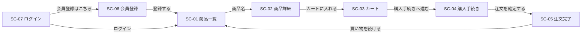

# ecsite 画面一覧・共通仕様書

ECサイトアプリの構成・画面一覧と、全画面に共通する仕様（ヘッダー・認証・アクセス制御・メッセージ・表示形式・エラー画面）をまとめる。各画面の詳細は画面ごとの設計書、APIの詳細は「ecsite-API設計書.md」、テーブル構成は「ecsite-ER図・テーブル定義書.md」を参照。

## 1. 前提

### 1.1 構成

- **フロントエンド**: React（TypeScript）による SPA。ビルドは Vite、画面遷移は React Router で行う。画面はすべてブラウザ側で描画し、データはバックエンドの JSON API から取得する。
- **バックエンド**: Go + Gin による JSON API。DBアクセスは GORM、認証は JWT、パスワードハッシュは bcrypt で行う。
- **DB**: PostgreSQL 17（`app/docker`）。スキーマはDDL（`app/docker/postgresql/initdb/01_init.sql`）で作成し、GORM の `AutoMigrate` は使わない。
- **レイヤー構成（バックエンド）**: `handler`（リクエスト・レスポンスの変換、入力チェック）→ `service`（業務ロジック、トランザクション）→ `repository`（GORM によるDBアクセス）→ `model`（テーブルに対応する構造体）。
- **対象外**: 管理画面（商品・カテゴリ登録、注文ステータス変更）、注文履歴画面、配送先住所の編集・削除画面、会員情報変更・退会、パスワード再設定、実際の決済処理。

### 1.2 ディレクトリ構成

```
app/
├── docker/                    # PostgreSQL（既存）
├── backend/                   # Go
│   ├── go.mod
│   ├── cmd/server/main.go     # 起動・ルーティング
│   └── internal/
│       ├── config/            # 環境変数の読み込み
│       ├── model/             # GORM モデル
│       ├── repository/        # DBアクセス
│       ├── service/           # 業務ロジック・トランザクション
│       ├── handler/           # Gin ハンドラ・入力チェック
│       ├── middleware/        # 認証・CSRF対策ヘッダー・エラー処理
│       └── auth/              # JWT の発行・検証、パスワードハッシュ
└── frontend/                  # React
    ├── package.json
    ├── vite.config.ts
    └── src/
        ├── main.tsx
        ├── App.tsx            # ルーティング定義
        ├── api/               # API クライアント
        ├── components/        # 共通ヘッダー・メッセージ表示・ルートガード等
        ├── pages/             # 画面コンポーネント
        └── utils/             # 金額・日時の表示形式
```

### 1.3 起動構成

| 用途 | 構成 |
|---|---|
| 開発時 | バックエンド `http://localhost:8080`、フロントエンド開発サーバー（Vite）`http://localhost:5173`。Vite の proxy で `/api` をバックエンドへ転送する（ブラウザからは同一オリジンに見える） |
| 試験・本番 | フロントエンドをビルド（`npm run build`）し、バックエンドが `frontend/dist` の静的ファイルを配信する。`/api` 以外のパスで該当ファイルが無い場合は `index.html` を返す（SPA のルーティング用）。アクセス先は `http://localhost:8080` の1つ |

- バックエンドの設定は環境変数で与える（DB接続情報、`JWT_SECRET`、`SERVER_PORT`、`COOKIE_SECURE`、`STATIC_DIR`）。`app/.env.example` に項目を列挙する。
- 日時はすべて日本時間（`Asia/Tokyo`）で扱う。

## 2. 画面一覧

画面のURL（フロントエンドのルート）は以下のとおり。`/` は `/products` へ遷移する（履歴を置き換える）。

| 画面ID | 画面名称 | URL | ログイン要否 | 設計書 |
|---|---|---|---|---|
| SC-01 | 商品一覧画面 | `/products` | 不要 | ecsite-商品一覧画面設計書.md |
| SC-02 | 商品詳細画面 | `/products/:id` | 不要 | ecsite-商品詳細画面設計書.md |
| SC-03 | カート画面 | `/cart` | 必要 | ecsite-カート画面設計書.md |
| SC-04 | 購入手続き画面 | `/checkout` | 必要 | ecsite-購入手続き画面設計書.md |
| SC-05 | 注文完了画面 | `/orders/:orderNumber/complete` | 必要 | ecsite-注文完了画面設計書.md |
| SC-06 | 会員登録画面 | `/signup` | 不要（ログイン中は表示しない） | ecsite-会員登録画面設計書.md |
| SC-07 | ログイン画面 | `/login` | 不要（ログイン中は表示しない） | ecsite-ログイン画面設計書.md |
| - | ページが見つかりません | 上記以外のURL等（6章） | 不要 | 本書6章 |
| - | システムエラー | APIエラー時（6章） | 不要 | 本書6章 |

### 画面遷移



共通ヘッダー（3章）からは、全画面からサイト名で SC-01、「カート」で SC-03、「ログイン」で SC-07、「会員登録」で SC-06 へ遷移できる。

## 3. 共通ヘッダー

全画面の上部に表示する（コンポーネント `src/components/Header.tsx`）。ログイン状態とカート数量は `GET /api/me` で取得する。

| 表示名（論理名） | 種別 | 必須性 | 初期値／表示内容 | 操作可否 | 備考 |
|---|---|---|---|---|---|
| サイト名リンク | リンク | - | 「ECサイト」 | 遷移可 | `/products` へ遷移 |
| ログインリンク | リンク | - | 「ログイン」 | 遷移可 | 未ログイン時のみ表示。`/login` へ遷移 |
| 会員登録リンク | リンク | - | 「会員登録」 | 遷移可 | 未ログイン時のみ表示。`/signup` へ遷移 |
| ユーザー名表示 | テキスト表示 | - | 「{氏名} さん」 | 表示のみ | ログイン中のみ表示。`users.name` |
| カートリンク | リンク | - | 「カート（{数量}）」 | 遷移可 | ログイン中のみ表示。`/cart` へ遷移。{数量} はログインユーザーの `cart_items.quantity` の合計（0件なら 0） |
| ログアウトボタン | ボタン | - | 「ログアウト」 | 押下可 | ログイン中のみ表示。`POST /api/auth/logout` を呼び出す |

- カートの内容を変更する操作（追加・数量変更・削除・注文確定）の後は `GET /api/me` を再取得し、カートリンクの数量を更新する。
- ログイン状態の確認中（`GET /api/me` の応答待ち）は、ログインリンク・会員登録リンク・ユーザー名表示・カートリンク・ログアウトボタンのいずれも表示しない。

## 4. 認証・アクセス制御

### 4.1 JWT

- ログイン・会員登録に成功すると、バックエンドが JWT を発行し、Cookie `ecsite_token` に設定する。
  - 署名方式: HS256（鍵は環境変数 `JWT_SECRET`）
  - クレーム: `sub`（ユーザーID）、`iat`（発行日時）、`exp`（有効期限。発行から24時間）
  - Cookie 属性: `HttpOnly`、`SameSite=Lax`、`Path=/`、有効期限は JWT と同じ24時間。`Secure` は環境変数 `COOKIE_SECURE=true` のとき付与する（ローカルの http では付与しない）
- JWT は `HttpOnly` Cookie に入れ、JavaScript（`localStorage` 等）からは扱わない。フロントエンドはログイン状態を `GET /api/me` の応答で判断する。
- リフレッシュトークンは使わない。有効期限が切れたら再ログインが必要になる。
- ログアウト（`POST /api/auth/logout`）は Cookie `ecsite_token` を削除する。JWT はサーバー側で無効化しないため、Cookie 以外の経路でトークンを保持していれば有効期限まで使える（本アプリではトークンを Cookie 以外に出さない）。
- ログインのたびに新しい JWT を発行する。

### 4.2 API のアクセス制御

- **ログイン不要のAPI**: `GET /api/me`（未ログインなら401を返す）、`GET /api/categories`、`GET /api/products`、`GET /api/products/:id`、`POST /api/auth/signup`、`POST /api/auth/login`、`POST /api/auth/logout`。
- **ログイン必要のAPI**: 上記以外（カート・購入手続き・注文）。Cookie の JWT が無い・署名不正・有効期限切れ・ユーザーが存在しない場合は `401` を返す。
- 他ユーザーのデータ（カート明細・住所・注文）は、すべて「ID かつ ログインユーザーの `user_id`」で検索し、他ユーザーのデータは存在しないもの（`404`）として扱う。

### 4.3 CSRF 対策

- Cookie は `SameSite=Lax` のため、他サイトから送信された POST 等のリクエストには JWT が付かない。
- 加えて、状態を変更するAPI（`POST`・`PATCH`・`DELETE`）はリクエストヘッダー `X-Requested-With: XMLHttpRequest` を必須とし、無い場合は `403` を返す。フロントエンドの API クライアントは全リクエストにこのヘッダーを付ける。

### 4.4 画面のアクセス制御（フロントエンド）

- **ログインが必要な画面**（SC-03・SC-04・SC-05）: `GET /api/me` が401の場合は画面を表示せず、`/login` へ遷移する。その際、元の画面のURL（クエリ文字列を含む）を遷移元として渡し、ログイン成功後にそのURLへ戻る。
- **ログイン中は表示しない画面**（SC-06・SC-07）: `GET /api/me` が成功した場合は画面を表示せず、`/products` へ遷移する。
- **API が401を返した場合**（有効期限切れ等）: 画面の表示中にAPIが401を返した場合も、現在のURLを遷移元として `/login` へ遷移する。
- 画面遷移はいずれも履歴を置き換える（ブラウザの「戻る」で遷移前の画面に戻らない）。

## 5. メッセージ・表示形式

### 5.1 画面メッセージ

操作結果を遷移先の画面で1回だけ表示するメッセージ。React Router の遷移時に state として渡し、ヘッダー直下に表示する（コンポーネント `src/components/FlashMessage.tsx`）。

| 種類 | 表示色 | 用途 |
|---|---|---|
| 成功 | 緑 | 処理が完了したことの通知 |
| エラー | 赤 | 処理を行わなかったことの通知 |

- メッセージは次の画面遷移またはブラウザの再読み込みで消える。
- 同じ画面にとどまって結果を表示する場合（例: カート画面での数量変更）も、同じ場所に表示する。新しいメッセージを表示するときは前のメッセージを消す。

### 5.2 表示形式

| 対象 | 形式 | 例 |
|---|---|---|
| 金額 | 「¥」+ 3桁区切りの整数 | `¥1,980`、`¥0` |
| 日時 | `yyyy/MM/dd HH:mm` | `2026/09/21 14:05` |
| 郵便番号 | 「〒」+ 3桁-4桁 | `〒123-4567` |
| 商品画像 | `products.image_url`。未設定（NULL）の場合は代替画像 `/images/no-image.png` | - |

- APIは金額を整数（円）、日時を ISO 8601 形式（例: `2026-09-21T14:05:00+09:00`）で返し、表示形式への変換はフロントエンドで行う。

### 5.3 通信中の表示

- 画面の初期表示でデータを取得している間は、画面見出しの下に「読み込み中...」を表示する。
- ボタンを押してAPIを呼び出している間は、そのボタンを押下不可にする（二重送信の防止）。

## 6. エラー画面

| 条件 | 表示する画面 | 表示内容 |
|---|---|---|
| 2章に無いURL。画面のURLのIDが数値でない（例: `/products/abc`）。画面の初期表示で呼び出したAPIが404を返した | ページが見つかりません（`src/pages/NotFoundPage.tsx`） | 見出し「ページが見つかりません」、本文「お探しのページは存在しないか、削除された可能性があります。」、「商品一覧へ戻る」リンク（`/products`） |
| APIが500を返した、またはバックエンドに接続できない | システムエラー（`src/pages/SystemErrorPage.tsx`） | 見出し「システムエラーが発生しました」、本文「時間をおいて再度お試しください。」、「商品一覧へ戻る」リンク（`/products`） |

- エラー画面にも共通ヘッダーを表示する。URLは元の画面のまま変えない。
- SPA のため、エラー画面のHTTPステータスはいずれも200（`index.html` の応答）になる。APIのHTTPステータスは「ecsite-API設計書.md」を参照。
- 例外の詳細（スタックトレース・エラーメッセージ）は画面・APIのレスポンスに含めず、バックエンドのログにのみ出力する。
- バックエンドで例外が発生した場合、処理中のトランザクションはロールバックされ、DBは処理前の状態のままとなる。
